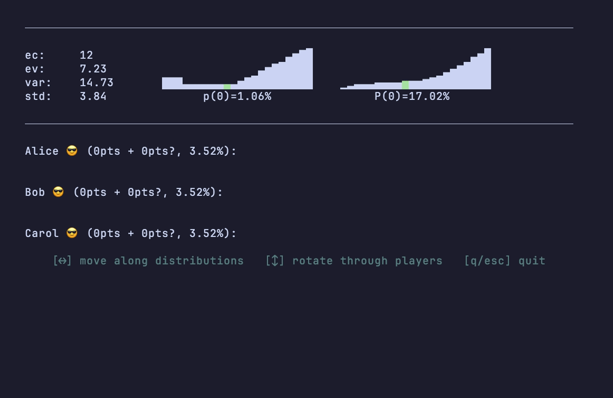
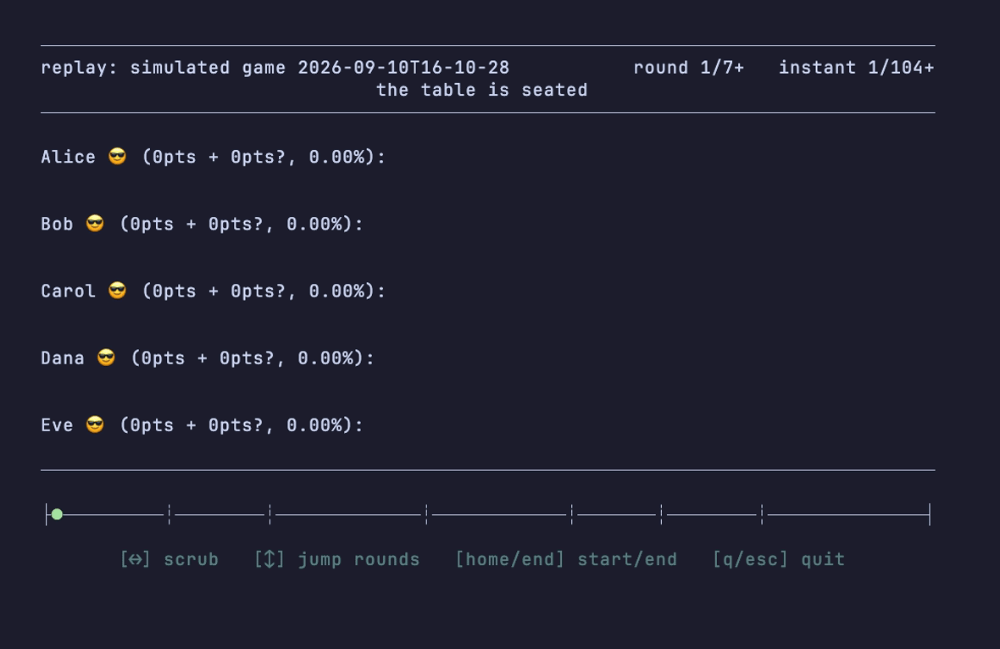

# Flip7

In this press your luck game, be the first player to score 200 points to win. You score points based on the total number value of the cards in front of you. The more valuable a card is, the more copies of that card there are in the deck. If you can successfully Flip 7 unique Number cards into your line, you automatically end the round for everyone and score 15 bonus points. However, if you ever draw a second card with the same number as one already in your line, you bust and are out of the round, scoring nothing.

## Features

This repo contains an F# engine for the game plus a terminal UI (`Flip7.UI`) with two modes: a live tracker for following along with a real game, and a simulator with full timeline replay.

### Live game tracker

Run the UI with the names of the people at the table (`dotnet run --project ui -- Alice Bob Carol`) and type cards as they are dealt to keep the tracker in sync with the real game:

- The header shows live deck statistics — expected count, expected value, variance, and standard deviation — alongside pdf/cdf sparklines of the cards still in the deck. Move the cursor along the distributions with the arrow keys to read off the exact probability of drawing any card, and use `+`/`-` to correct a card's count in the deck.
- Rotate down through the players and type what they draw: `0`–`9` for number cards, `x`/`e`/`t` for 10/11/12, shift for the modifier cards (`!`, `@`, `$`, `^`, `*`, `X` for x2, +2, +4, +6, +8, +10), and `s`/`d`/`f` for Second Chance, Deal3, and Freeze.
- Every player line shows their firm score, tentative score for the round, and a live bust probability computed by simulating the remaining deck — so you know exactly how risky one more flip is.
- Duplicate numbers render as a bust (and impossible states, like more copies of a card than exist, are flagged). Backspace undoes the last card, returning it to the deck.
- Enter commits the round: busts score nothing, everyone else banks their tentative points, and all hands move to the discard pile — which the deck statistics then account for.

### Simulation and timeline replay

Run `dotnet run --project ui -- --simulate Alice Bob Carol Dana Eve` to simulate a full game to 200 points (each player is assigned a different strategy) and immediately scrub through it:

- Scrub instant by instant with the mouse wheel / trackpad or the left/right arrow keys; up/down jump between round boundaries, and Home/End snap to the start or end of the game.
- Click anywhere on the progress bar — round boundaries are marked on it — to jump straight to that point in the game.
- Every instant replays the complete game state: each player's hand, firm and tentative scores, live bust probability, and a caption describing the event (draws, stands, busts, freezes, Second Chance passes, Deal3 resolutions, Flip 7s, and round scoring).

Games can also be persisted and replayed later with `--replay <directory>`.

## Dealing

In turn order, the dealer deals one card face up to each player including themselves. If an action card comes up in dealing, pause dealing immediately to resolve it. Once any Action cards are resolved, continue dealing until everyone's dealt a card. Not everyone will have a Number card at this point. Some players may have a number or or even three or four cards depending on what action cards are dealt.

## Scoring

Add the value of your number cards first, then multiply by 2 (if you have the x2 modifier card), then add any additional modifier cards, and finally, if you flipped 7 number cards, add the +15 bonus points to your score for the round.

## Action cards (deal3)

Deal3 is really hard to resolve with many edge cases.
